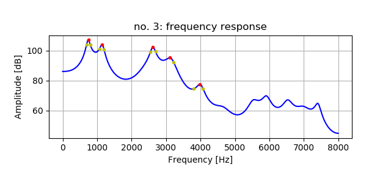

# glottal source spectrum   


## content  

some frequency response  samples of pseudo glottal source waveform  
```
python3 glottal2mass.py
```
 


get a low shelving filter as inverse filter against high pass filter that simulates radiation from mouth  
```
python3 iir_LowShelving1.py
```
  


estimate formant peak frequency and Q factor based on LPC analysis  
```
python3 get_fp4.py -w wav-file-name(mono,16bit) -f frame-number
```
  


resampling to 16Khz sampling  
```
python resample1.py -w wav-file-name(mono,16bit)  
```


## License    
MIT  
except LPC.py  

