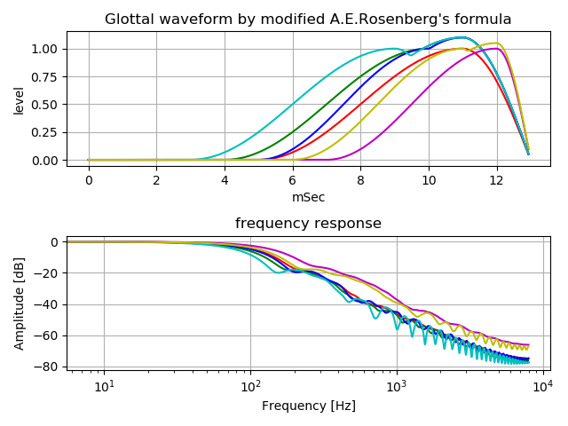
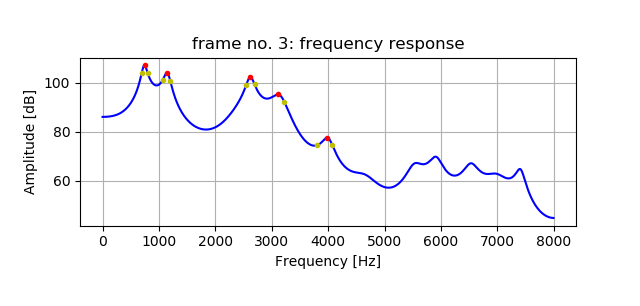
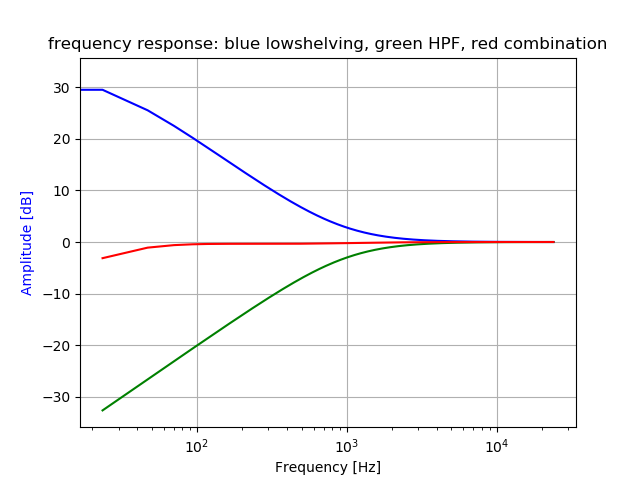
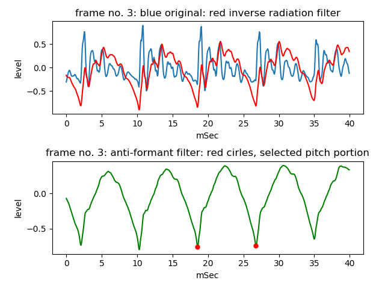
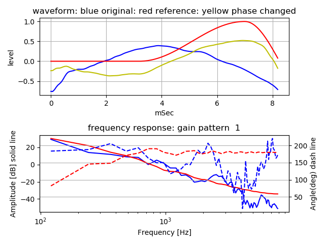

# glottal source spectrum   

A trial estimation of glottal source spectrum by anti-formant filter and inverse radiation filter.  

[github repository](https://github.com/shun60s/glottal-source-spectrum/)  

## contents  

some frequency response  samples of pseudo glottal source waveform  
```
python3 glottal2mass.py
```
 


estimate formant peak frequency and Q factor based on LPC analysis  
```
python3 get_fp4.py -w wav-file-name(mono,16bit) -f frame-number
```
  


get a low shelving filter as inverse filter against high pass filter that simulates radiation from mouth  
```
python3 iir_LowShelving1.py
```
  


peaking filter class to drop formant boost portion, anti-formant filter  
```
iir_peaking1.py
```

estimate of glottal source spectrum condition by anti-formant filter and inverse radiation filter  
```
examples:
  vowel /a/        : python3 est_gss1.py -w a_1-16k.wav  -f 3 -g 1  
  nasal voice /na/ : python3 est_gss1.py -w na_1-16k.wav -f 8 -g 2  
```
  

glottal source spectrum condition  
  


resampling wav to 16Khz sampling  
```
python resample1.py -w wav-file-name(mono,16bit)  
```


## License    
MIT  
except LPC.py  

